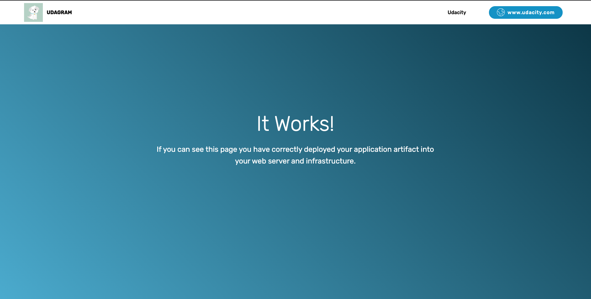

# Deploy a High-Availability Web App using CloudFormation

This is a Cloud Formation template that deployes some applications in EC2 Instances in the private Subnets in our VPC while exposing the app within the private subnet to the Public internet using a Public `internet-facing` LoadBalancer.

## How To Run the Cloud Formation Script
In order to run this script, please do the following:

  1. First ensure that you already have AWS CLI installed on your instance/machine
  2. clone this repo and then change directory into the `udacity-deploy-cloudformation` directory.
  3. If you choose to use the `default` cloudformation `parameters`, then go ahead and run the command **`aws cloudformation create-stack --stack-name asg-instances --template-body file://final-project.yaml  --capabilities CAPABILITY_NAMED_IAM`** in your terminal while still in the `udacity-deploy-cloudformation` directory.
  If however you would like to supply your own values to the parameters, then the above command should be updated to look like this 
  **`aws cloudformation create-stack --stack-name asg-instances --template-body file://final-project.yaml --paramerter ParameterKey=<KEY>,ParameterValue=<VALUE> ParameterKey=<KEY>,ParameterValue=<VALUE> --capabilities CAPABILITY_NAMED_IAM`**, or you can create a parameters file where you'd store the key=value pairs for your use.
  4. After all this is done it within 5 mins the  resources should be created. You can check Stack on the cloudformation service page where on the `Outputs` tab, you would find the URL for the loadbalancer exposing the applications there.  
  
  The link or URL should look like this `http://asg-i-MyLoa-ONCPTAOLHQ1R-612334796.eu-west-1.elb.amazonaws.com`

The website should look like this 

